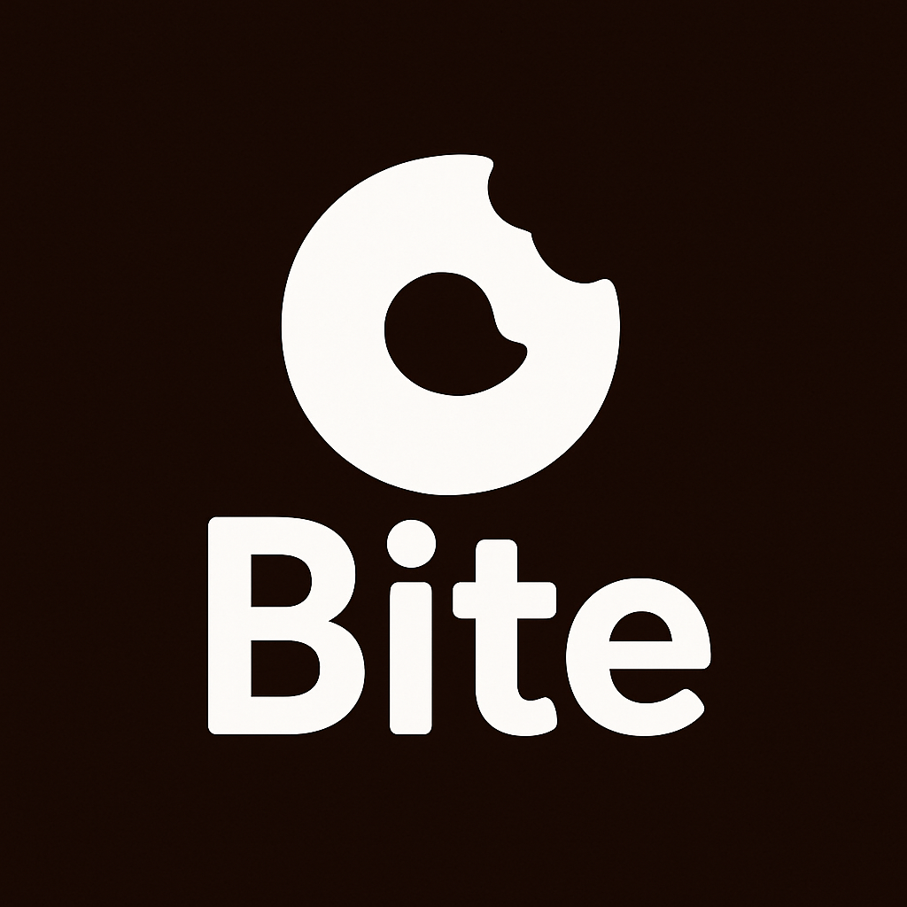
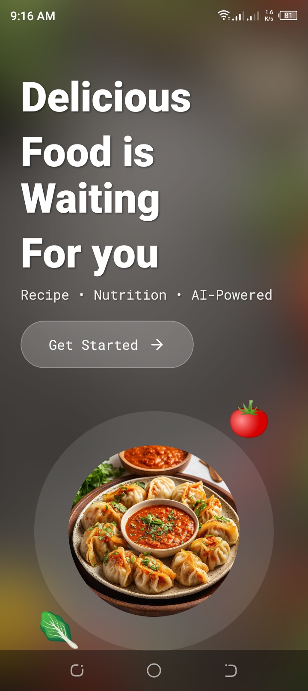
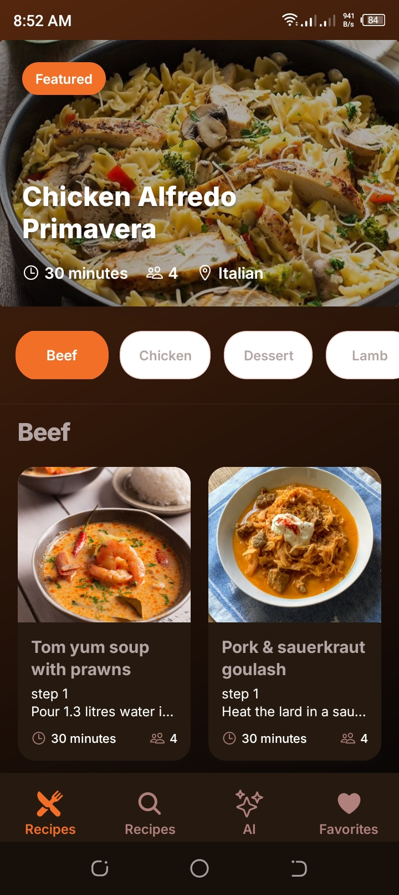
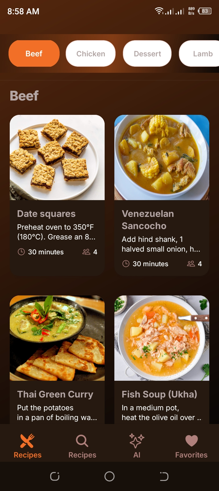
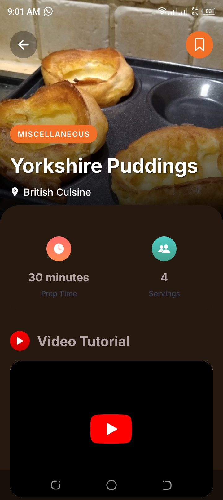
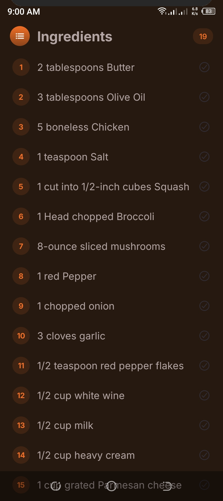
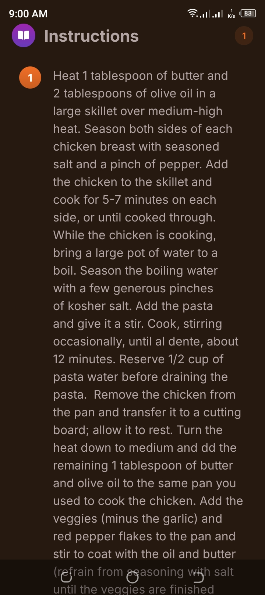

<p align="center">
  
</p>

# 🍴 Bite - AI-Powered Recipe App

> Snap a photo, get a recipe! Bite uses advanced AI to identify dishes and generate detailed recipes from your food photos.

[](LICENSE)
[]()
[]()
[]()
[]()

**A modern, AI-powered recipe application built with React Native and Express.js**

[Features](#-features) • [Quick Start](#-quick-start) • [Documentation](#-api-documentation) • [Contributing](#-contributing)

---

## 📸 Screenshots

<div align="center">
  <table>
    <tr>
      <td align="center">
        <br/>
        <b>Home Screen</b>
      </td>
      <td align="center">
        <br/>
        <b>AI Scanner</b>
      </td>
      <td align="center">
        <br/>
        <b>Recipe Details</b>
      </td>
    </tr>
    <tr>
      <td align="center">
        <br/>
        <b>Search Recipes</b>
      </td>
      <td align="center">
        <br/>
        <b>Favorites</b>
      </td>
      <td align="center">
        <br/>
        <b>AI Generated Recipe</b>
      </td>
    </tr>
  </table>
</div>

---

---

## ✨ Features

### 🤖 AI-Powered Recognition
- **Dish Identification**: Instantly identify dishes from photos
- **Recipe Generation**: Generate detailed recipes with ingredients and instructions
- **Smart Analysis**: Powered by Google's advanced Gemini 2.0 Flash AI model
- **High Accuracy**: Get precise dish names and cooking details

### 📱 Mobile Experience
- **Cross-platform**: iOS and Android support with Expo
- **Offline Storage**: Save recipes locally with SQLite
- **Beautiful UI**: Modern, intuitive interface with smooth animations
- **Photo Integration**: Seamless camera and gallery integration
- **Fast & Responsive**: Optimized performance for smooth UX

### 🔍 Discovery & Search
- **Recipe Search**: Find recipes by name, ingredients, or cuisine
- **Category Filtering**: Browse by meal type, cuisine, or difficulty
- **Favorites**: Save and organize your favorite recipes
- **Smart Suggestions**: Get personalized recipe recommendations

### 🔧 Developer Experience
- **TypeScript**: Full type safety across the entire codebase
- **Monorepo**: Organized workspace with pnpm for efficient development
- **Clean Architecture**: Separation of concerns with clean code principles
- **Hot Reload**: Fast development with instant feedback
- **Well-Tested**: Comprehensive test coverage

---

## 🛠️ Tech Stack

**Frontend (Mobile)**


**Backend (API)**


**Tools & Infrastructure**


---

### 🎯 Key Architectural Principles

| Principle | Implementation | Benefits |
|-----------|---------------|----------|
| **Separation of Concerns** | Clean layered architecture | Easy maintenance and testing |
| **Type Safety** | TypeScript across entire stack | Catch errors at compile time |
| **Modularity** | Monorepo with workspaces | Independent scaling & deployment |
| **Offline-First** | SQLite local storage | Works without internet |
| **API-Driven** | RESTful API design | Platform-agnostic integration |

---

### 📱 Mobile App Architecture

**Technology Stack:**
- **Framework**: Expo SDK 51 with React Native
- **Navigation**: Expo Router (file-based routing)
- **State Management**: React Context API + Local State
- **Database**: SQLite with Drizzle ORM
- **Styling**: StyleSheet with custom design system
- **AI Integration**: REST API calls to backend
- **Image Handling**: Expo Image Picker & Camera


---

### 🚀 Backend API Architecture

**Technology Stack:**
- **Runtime**: Bun (primary) / Node.js (fallback)
- **Framework**: Express.js with TypeScript
- **AI Engine**: Google Genkit with Gemini 2.0 Flash
- **Validation**: Zod schemas for type-safe validation
- **Error Handling**: Centralized middleware
- **Architecture Pattern**: Clean Architecture


---

### 🤖 AI Processing Flow

The AI processing pipeline handles image analysis and recipe generation:

1. **Image Upload**: Mobile app captures/selects image → converts to Data URI
2. **API Request**: Sends Data URI to backend endpoint
3. **Validation**: Zod schema validates request format
4. **AI Processing**: 
   - Genkit routes request to Gemini 2.0 Flash
   - Image is analyzed for dish identification
   - Recipe is generated with structured output
5. **Response**: Typed response sent back to mobile
6. **Local Storage**: Recipe saved to SQLite for offline access


---

## 🔧 Configuration

### Environment Variables

#### API Configuration (`api/.env`)
```bash
# Server Configuration
PORT=5001
NODE_ENV=development

# AI Service
GOOGLE_GENAI_API_KEY=your_google_ai_api_key

# Optional: Logging
LOG_LEVEL=info
```

#### Mobile Configuration
```bash
# Expo configuration is in app.json
# API endpoint is configured in mobile/constants/api.ts
```


## 📄 License

This project is licensed under the MIT License - see the [LICENSE](LICENSE) file for details.
