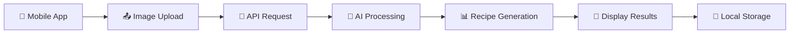

# 🍴 Bite - AI-Powered Recipe App

> Snap a photo, get a recipe! Bite uses advanced AI to identify dishes and generate detailed recipes from your food photos.

[](LICENSE)
[]()
[]()
[]()
[]()

A modern, AI-powered recipe application built with React Native and Express.js. Bite helps food enthusiasts discover recipes by simply taking photos of dishes they love.

## ✨ Features

### 🤖 AI-Powered Recognition
- **Dish Identification**: Instantly identify dishes from photos
- **Recipe Generation**: Generate detailed recipes with ingredients and instructions
- **Smart Analysis**: Powered by Google's advanced Gemini 2.0 Flash AI model

### 📱 Mobile Experience
- **Cross-platform**: iOS and Android support with Expo
- **Offline Storage**: Save recipes locally with SQLite
- **Beautiful UI**: Modern, intuitive interface with smooth animations
- **Photo Integration**: Seamless camera and gallery integration

### 🔧 Developer Experience
- **TypeScript**: Full type safety across the entire codebase
- **Monorepo**: Organized workspace with pnpm for efficient development
- **Clean Architecture**: Separation of concerns with clean code principles
- **Hot Reload**: Fast development with instant feedback

## 📁 Project Structure

```
bite/
├── 📱 mobile/              # React Native Expo app
│   ├── app/               # App screens and navigation
│   ├── components/        # Reusable UI components
│   ├── services/          # API services and business logic
│   ├── database/          # SQLite schema and migrations
│   └── types/             # TypeScript type definitions
├── 🚀 api/                # Express.js backend API
│   ├── src/
│   │   ├── ai/           # AI services and flows
│   │   ├── controllers/  # Route controllers
│   │   ├── middleware/   # Express middlewares
│   │   └── routes/       # API route definitions
│   └── dist/             # Compiled JavaScript output
├── 📚 docs/              # Documentation
├── 🔧 scripts/           # Build and utility scripts
└── 📦 packages/          # Shared packages (future)
```

## 🚀 Quick Start

### Prerequisites

Before you begin, ensure you have the following installed:

- **Node.js** (v18 or higher) - [Download here](https://nodejs.org/)
- **pnpm** (v10.16.1+) - Install with `npm install -g pnpm`
- **Git** - For version control
- **Google AI API Key** - [Get one here](https://ai.google.dev/)

### Installation

1. **Clone the repository**:
   ```bash
   git clone https://github.com/nyambogahezron/bite.git
   cd bite
   ```

2. **Install dependencies**:
   ```bash
   pnpm install
   ```

3. **Configure environment variables**:
   ```bash
   # Create environment file for API
   cp api/.env.example api/.env
   
   # Edit api/.env with your configuration:
   # PORT=5001
   # NODE_ENV=development
   # GOOGLE_GENAI_API_KEY=your_api_key_here
   ```

4. **Start development servers**:
   ```bash
   # Start both API and mobile app
   pnpm dev
   
   # Or start individually:
   pnpm api:dev      # API server on http://localhost:5001
   pnpm mobile:dev   # Mobile app with Expo
   ```

### First Time Setup

1. **API Setup**: Make sure your Google AI API key is configured
2. **Mobile Setup**: Install Expo Go app on your device for testing
3. **Test Connection**: Verify API connectivity from mobile app

## 🛠️ Development Commands

### Universal Commands
```bash
# Start all development servers
pnpm dev

# Build all applications
pnpm build

# Run all tests
pnpm test

# Lint all code
pnpm lint

# Clean all build artifacts
pnpm clean

# Type checking across all workspaces
pnpm type-check
```

### API-Specific Commands
```bash
# API development server (with hot reload)
pnpm api:dev

# Build API for production
pnpm api:build

# Start production API server
pnpm api:start

# API type checking
pnpm api:type-check

# API tests
pnpm api:test
```

### Mobile-Specific Commands
```bash
# Start Expo development server
pnpm mobile:dev

# Start with specific platform
pnpm mobile:ios      # iOS simulator
pnpm mobile:android  # Android emulator
pnpm mobile:web      # Web browser

# Build for production
pnpm mobile:build

# Mobile tests
pnpm mobile:test
```

## 📦 Advanced Workspace Management

### Adding Dependencies

```bash
# Add dependency to specific workspace
pnpm add <package> --filter api
pnpm add <package> --filter mobile

# Add dev dependency to root workspace
pnpm add -D <package> -w

# Add dependency to all workspaces
pnpm add <package> --recursive
```

### Running Commands in Workspaces

```bash
# Run command in specific workspace
pnpm --filter api <command>
pnpm --filter mobile <command>

# Run command in all workspaces
pnpm --recursive <command>

# Run command with workspace prefix
pnpm -r --stream <command>  # Shows which workspace output comes from
```

### Workspace Filtering Examples

```bash
# Install dependencies for API only
pnpm install --filter api

# Build only mobile app
pnpm build --filter mobile

# Run tests for all workspaces with "test" in name
pnpm test --filter "*test*"

# Run lint for workspaces that changed
pnpm lint --filter "[HEAD^1]"
```

## 🏗️ Architecture Overview

### Mobile App (React Native + Expo)

- **Framework**: Expo SDK with React Native
- **Navigation**: Expo Router for file-based routing
- **State Management**: React Context + Local State
- **Database**: SQLite with Drizzle ORM
- **Styling**: StyleSheet with custom design system
- **AI Integration**: REST API calls to backend

### Backend API (Express.js + TypeScript)

- **Runtime**: Bun (primary) / Node.js (fallback)
- **Framework**: Express.js with TypeScript
- **AI Engine**: Google Genkit with Gemini 2.0 Flash
- **Architecture**: Clean Architecture with layered approach
- **Validation**: Zod for request/response schemas
- **Error Handling**: Centralized error middleware

### AI Processing Flow



## 🔧 Configuration

### Environment Variables

#### API Configuration (`api/.env`)
```bash
# Server Configuration
PORT=5001
NODE_ENV=development

# AI Service
GOOGLE_GENAI_API_KEY=your_google_ai_api_key

# Optional: Logging
LOG_LEVEL=info
```

#### Mobile Configuration
```bash
# Expo configuration is in app.json
# API endpoint is configured in mobile/constants/api.ts
```

## 📊 API Documentation

### Base URL
```
Development: http://localhost:5001
Production: https://your-api-domain.com
```

### Authentication
Currently, the API is open for development. Authentication will be added in future versions.

### Endpoints

#### POST `/api/ai/identify-dish`
Identify a dish from an uploaded image.

**Request Body:**
```json
{
  "photoDataUri": "data:image/jpeg;base64,/9j/4AAQSkZJRgABAQAAAQ..."
}
```

**Response:**
```json
{
  "dishName": "Spaghetti Carbonara",
  "confidence": 0.95,
  "cuisine": "Italian",
  "description": "Classic Roman pasta dish..."
}
```

#### POST `/api/ai/generate-recipe`
Generate a detailed recipe from a food image.

**Request Body:**
```json
{
  "photoDataUri": "data:image/jpeg;base64,/9j/4AAQSkZJRgABAQAAAQ..."
}
```

**Response:**
```json
{
  "title": "Homemade Spaghetti Carbonara",
  "description": "A creamy, authentic Italian pasta dish...",
  "prepTime": "15 minutes",
  "cookTime": "20 minutes",
  "servings": 4,
  "difficulty": "Medium",
  "ingredients": [
    {
      "name": "Spaghetti",
      "amount": "400",
      "unit": "grams"
    }
  ],
  "instructions": [
    {
      "step": 1,
      "instruction": "Bring a large pot of salted water to boil..."
    }
  ],
  "tips": ["Use fresh eggs for best results..."],
  "nutrition": {
    "calories": 520,
    "protein": 22,
    "carbs": 58,
    "fat": 23
  }
}
```

### Error Responses
```json
{
  "error": "Validation failed",
  "details": ["photoDataUri must be a valid data URI"]
}
```

## 🧪 Testing

### Running Tests

```bash
# All tests
pnpm test

# Watch mode
pnpm test:watch

# Coverage report
pnpm test:coverage

# API tests only
pnpm api:test

# Mobile tests only
pnpm mobile:test
```

### Test Structure

```typescript
// Example API test
describe('AI Controller', () => {
  it('should identify dish from image', async () => {
    const response = await request(app)
      .post('/api/ai/identify-dish')
      .send({ photoDataUri: mockImageData })
      .expect(200);
    
    expect(response.body).toHaveProperty('dishName');
    expect(response.body.confidence).toBeGreaterThan(0.5);
  });
});

// Example mobile component test
describe('RecipeCard', () => {
  it('renders recipe information correctly', () => {
    render(<RecipeCard recipe={mockRecipe} />);
    
    expect(screen.getByText(mockRecipe.title)).toBeInTheDocument();
    expect(screen.getByText(mockRecipe.description)).toBeInTheDocument();
  });
});
```

## 📱 Mobile App Features

### Screen Overview

- **🏠 Home**: Recipe discovery and featured content
- **📸 AI Scanner**: Camera integration for dish identification
- **🔍 Search**: Search existing recipes and ingredients
- **❤️ Favorites**: Saved recipes and personal collection
- **👤 Profile**: User settings and preferences

### Key Components

- **📱 RecipeCard**: Displays recipe information with image
- **🤖 AIRecipeCard**: Shows AI-generated recipe details
- **📋 RecipeBottomSheet**: Full recipe view in modal
- **🔄 LoadingSpinner**: Consistent loading states
- **💀 Skeletons**: Loading placeholders for better UX

## 🎨 Design System

### Colors
```typescript
export const colors = {
  primary: '#FF6B6B',      // Main brand color
  secondary: '#4ECDC4',    // Accent color
  background: '#F8F9FA',   // Light background
  surface: '#FFFFFF',      // Card backgrounds
  text: '#2D3436',         // Primary text
  textLight: '#636E72',    // Secondary text
  error: '#E74C3C',        // Error states
  success: '#00B894',      // Success states
  warning: '#FDCB6E',      // Warning states
};
```

### Typography
```typescript
export const fonts = {
  regular: 'Inter-Regular',
  medium: 'Inter-Medium',
  bold: 'Inter-Bold',
  sizes: {
    small: 12,
    medium: 14,
    large: 16,
    xlarge: 20,
    xxlarge: 24,
  },
};
```

## 🚀 Deployment

### API Deployment

```bash
# Build for production
pnpm api:build

# Start production server
pnpm api:start

# Or use Docker
docker build -t bite-api .
docker run -p 5001:5001 bite-api
```

### Mobile App Deployment

```bash
# Build for app stores
npx eas build --platform all

# Submit to stores
npx eas submit --platform all

# Or build locally
npx expo export --platform all
```

### Environment Configuration

```bash
# Production environment variables
NODE_ENV=production
PORT=5001
GOOGLE_GENAI_API_KEY=prod_api_key
```

## 🤝 Contributing

We welcome contributions! Please see our [Contributing Guide](CONTRIBUTIONS.md) for details.

### Quick Contribution Steps

1. Fork the repository
2. Create a feature branch: `git checkout -b feature/amazing-feature`
3. Make your changes
4. Add tests for new functionality
5. Ensure all tests pass: `pnpm test`
6. Commit your changes: `git commit -m 'Add amazing feature'`
7. Push to your fork: `git push origin feature/amazing-feature`
8. Create a Pull Request

### Development Guidelines

- Follow TypeScript best practices
- Write tests for new features
- Use conventional commit messages
- Update documentation as needed
- Ensure code passes linting: `pnpm lint`

## 📋 Roadmap

### Version 1.1 (Q1 2024)
- [ ] User authentication and profiles
- [ ] Recipe sharing and social features
- [ ] Advanced filtering and search
- [ ] Offline recipe generation

### Version 1.2 (Q2 2024)
- [ ] Meal planning features
- [ ] Shopping list generation
- [ ] Nutritional analysis
- [ ] Recipe ratings and reviews

### Version 2.0 (Q3 2024)
- [ ] Multi-language support
- [ ] Video recipe tutorials
- [ ] Advanced AI cooking assistant
- [ ] Integration with smart kitchen devices

## 🐛 Troubleshooting

### Common Issues

#### API Connection Errors
```bash
# Check if API is running
curl http://localhost:5001/health

# Verify environment variables
cat api/.env

# Restart development server
pnpm api:dev
```

#### Mobile App Issues
```bash
# Clear Expo cache
npx expo start --clear

# Reset Metro bundler
npx expo start --reset-cache

# Verify dependencies
pnpm install
```

#### Build Errors
```bash
# Clean and rebuild
pnpm clean
pnpm install
pnpm build

# Check TypeScript errors
pnpm type-check
```

### Getting Help

- 📖 Check [Documentation](docs/)
- 🐛 Report [Issues](ISSUES.md)
- 💬 Join [Discussions](https://github.com/nyambogahezron/bite/discussions)
- 📧 Contact maintainers

## 📚 Additional Resources

- **API Documentation**: [api/README.md](api/README.md)
- **Mobile Setup**: [mobile/README.md](mobile/README.md)
- **Contributing**: [CONTRIBUTIONS.md](CONTRIBUTIONS.md)
- **Security**: [SECURITY.md](SECURITY.md)
- **Code of Conduct**: [CODE_OF_CONDUCT.md](CODE_OF_CONDUCT.md)

## 📄 License

This project is licensed under the MIT License - see the [LICENSE](LICENSE) file for details.

## 🙏 Acknowledgments

- **Google AI** for providing the Gemini AI model
- **Expo Team** for the amazing React Native framework
- **Open Source Community** for the incredible tools and libraries
- **Contributors** who help make this project better

## 📊 Project Stats


---

<div align="center">

**Made with ❤️ by [Hezron Nyamboga](https://github.com/nyambogahezron)**

[⬆️ Back to top](#-bite---ai-powered-recipe-app)

</div>
